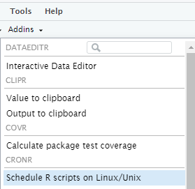
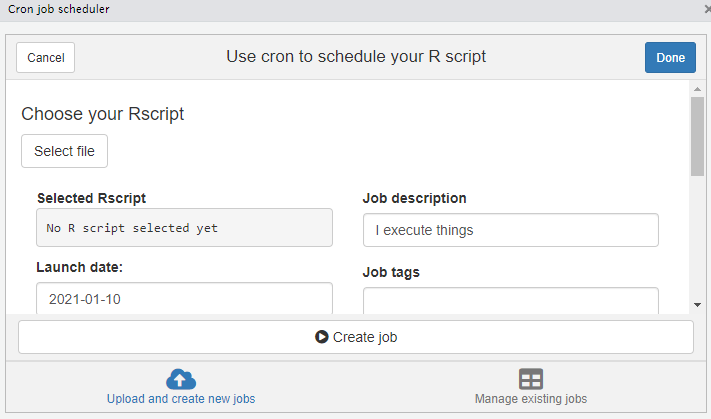

Возможность исполнять написанные скрипты по расписанию позволяет решать большое количество важных задач от ETL до формирования и отправки отчетности по почте или в мессенджер

*** 

## Установка библиотеки Cron

В каждой операционной системе есть возможность запускать файлы по расписанию. В Windows - планировщик задач, в Linux - Cron. Чтобы установить нужную нам библиотеку, необходимо выполнить код:

```{r eval=FALSE}
install.packages('cronR', dependencies = TRUE)
```

После установки, в меню "Addins" у нас появится новый раздел - **"Schedule R scripts on Linux/Unix"**



*** 

## Интерфейс Schedule R scripts

Для удобства работы с данной библиотекой был разработан UI с понятной навигацией. Разберём интерфейс.

После перехода по ссылке у нас откроется pop-up с двумя вкладками(внизу):

* Upload and create new jobs
* Manage existing jobs

 

Как понятно из названия, первая вкладка отвечает за настройку и запуск расписаний для скриптов, а вторая отвечает за управление, уже запущенными расписаниями.

*** 

## Запуск скрипта R по расписанию

В качестве скрипта может выступать любой файл с расширением R. Например, я запускаю каждый день по расписанию скрипт, который скачивает данные из Google Analytics и записывает результат в таблицу Google Sheets.

Проведём тестовую настройку

В качестве скрипта может выступать любой файл с расширением R. Например, я запускаю каждый день по расписанию скрипт, который скачивает данные из Google Analytics и записывает результат в таблицу Google Sheets

Проведём тестовую настройку:

* Select File - выбирает файл, который необходимо исполнять по расписанию
* Selected Rscript - показывает путь до файла(пригодится)
* Launch date - дата первого запуска
* Launch hour - час и минута первого запуска
* Schedule - периодичность выполнения(Once - один раз, Every min/hour/day/week/month - тут понятно, Asis - более мелкие периоды времени, что указываются в поле **ASIS cron schedule**)
* Job description - текстовое описание запускаемого расписания
* Job identifier - идентификатор, по которому мы потом будем искать нужный нам скрипт в панели **Manage existing jobs**
* Rscript repository path: launch & log location - служба cron не только исполняет скрипты по расписанию, но и пишет логи результатов, поэтому тут стоит указать адрес такой же, как для исполняемого скрипта. Чтобы оба файла лежали в одном месте

***
## Управление расписание скриптов

Во второй вкладке нас интересует одно поле и две кнопки:

* Select job - выбираем идентификатор нужного файла
* Show job - в консоли выводится детальная информация по расписанию(время запуска, периодичность, название и описание)
* Delete job - удаление расписания

Теперь вы сможете самостоятельно настроить расписание для автоматического выполнения скриптов R

***
## Дополнительные материалы
* [Запуск скриптов R по расписанию](http://baikulov.pro/r-cron.html)
* [Установка R-Studio через Docker](http://baikulov.pro/r-linux.html)
* [Установка R-Studio через Docker](http://baikulov.pro/r-docker.html)